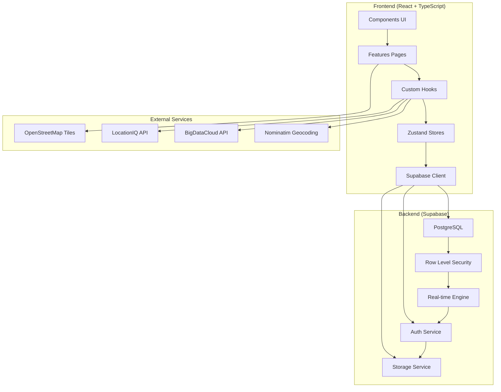
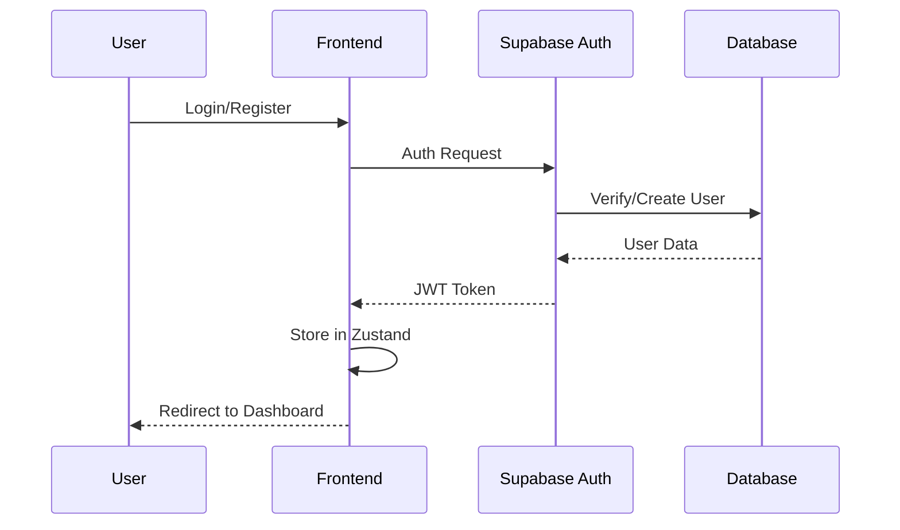
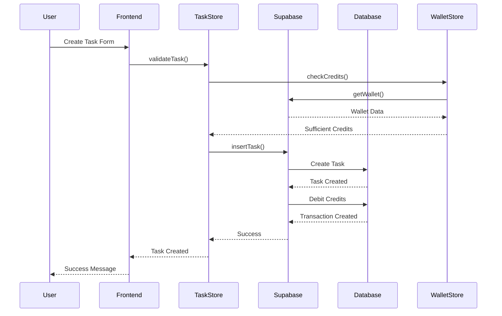
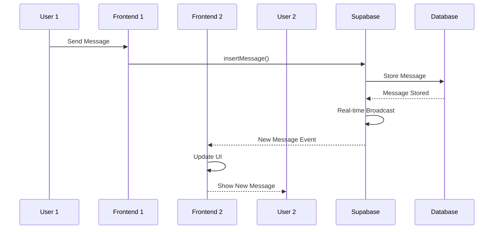

# 🏗️ Architecture Technique - Helpix

## 🎯 Vue d'Ensemble

Helpix suit une **architecture moderne frontend-first** avec un backend-as-a-service (Supabase), conçue pour être scalable, maintenable et performante. L'application adopte une approche component-driven avec séparation claire des responsabilités.

## 📐 Principes Architecturaux

### **1. Frontend-First Architecture**
- **React 18** avec concurrent features (Suspense, transitions)
- **TypeScript strict** pour la sécurité de type
- **Composants fonctionnels** avec hooks exclusivement
- **État immutable** avec Zustand

### **2. Feature-Based Organization**
- Modules organisés par fonctionnalité métier
- Composants réutilisables dans `/components`
- Logic business encapsulée dans hooks personnalisés
- Stores séparés par domaine

### **3. Real-Time First**
- Synchronisation temps réel avec Supabase subscriptions
- Optimistic updates pour la réactivité
- Gestion des états de connexion/déconnexion
- Fallbacks gracieux pour mode offline

### **4. Mobile-First Design**
- Interface responsive avec Tailwind CSS
- Navigation mobile native
- Gestures et animations touch-friendly
- Progressive Web App capabilities

## 🏛️ Architecture Globale



## 🗂️ Structure Détaillée

### **Frontend Layer Structure**

```
src/
├── components/           # Composants UI réutilisables
│   ├── ui/              # Design System
│   │   ├── Button.tsx   # Boutons avec variants
│   │   ├── Input.tsx    # Champs de saisie
│   │   ├── Card.tsx     # Cartes conteneurs
│   │   ├── Modal.tsx    # Modales et overlays
│   │   └── ...          # Autres composants UI
│   ├── layout/          # Composants de mise en page
│   │   ├── Navigation.tsx
│   │   └── Footer.tsx
│   ├── chat/            # Composants de messagerie
│   │   ├── ChatWindow.tsx
│   │   └── ConversationList.tsx
│   └── navigation/      # Navigation mobile
│       └── BottomNavigation.tsx
├── features/            # Fonctionnalités par domaine
│   ├── auth/           # Authentification
│   │   ├── Auth.tsx
│   │   └── Onboarding.tsx
│   ├── dashboard/      # Tableau de bord
│   │   ├── DashboardPage.tsx
│   │   ├── components/
│   │   └── types/
│   ├── wallet/         # Système de crédits
│   │   ├── WalletPage.tsx
│   │   ├── stores/walletStore.ts
│   │   ├── components/
│   │   └── types/
│   └── ...            # Autres features
├── hooks/              # Hooks personnalisés
│   ├── useAuth.ts      # Gestion authentification
│   ├── useGeolocation.ts # Géolocalisation
│   ├── useReverseGeocoding.ts # Géocodage inverse
│   └── useRealtimeMessages.ts # Messages temps réel
├── stores/             # Gestion d'état Zustand
│   ├── authStore.ts    # État authentification
│   ├── taskStore.ts    # État des tâches
│   ├── messageStore.ts # État des messages
│   ├── helpOfferStore.ts # État des offres
│   └── walletStore.ts  # État du portefeuille
├── lib/                # Utilitaires et configurations
│   ├── supabase.ts     # Client Supabase
│   ├── router.ts       # Configuration routing
│   ├── utils.ts        # Fonctions utilitaires
│   ├── creditUtils.ts  # Utilitaires crédits
│   └── creditPricing.ts # Tarification
└── types/              # Types TypeScript
    └── index.ts        # Définitions globales
```

### **Backend Layer Structure (Supabase)**

```
Supabase Project
├── Database (PostgreSQL)
│   ├── Tables
│   │   ├── users           # Utilisateurs
│   │   ├── tasks           # Tâches d'entraide
│   │   ├── wallets         # Portefeuilles
│   │   ├── transactions    # Transactions de crédits
│   │   ├── conversations   # Conversations
│   │   ├── messages        # Messages
│   │   ├── help_offers     # Offres d'aide
│   │   └── credit_earnings # Gains de crédits
│   ├── Functions
│   │   ├── credit_user_for_task_completion()
│   │   ├── process_withdrawal_request()
│   │   └── calculate_task_metrics()
│   ├── Triggers
│   │   ├── update_wallet_balance()
│   │   ├── create_notification()
│   │   └── update_task_progress()
│   └── Policies (RLS)
│       ├── users_policies
│       ├── tasks_policies
│       ├── wallets_policies
│       └── messages_policies
├── Auth
│   ├── Email/Password
│   ├── OAuth Providers
│   └── JWT Management
├── Storage
│   ├── avatars/
│   ├── task_attachments/
│   └── message_files/
└── Real-time
    ├── Subscriptions
    ├── Presence
    └── Broadcast
```

## 🔄 Flux de Données

### **1. Authentification**



### **2. Création de Tâche**



### **3. Messagerie Temps Réel**



## 🗄️ Gestion d'État

### **Architecture Zustand**

```typescript
// Store Pattern
interface StoreState {
  // État
  data: DataType[];
  isLoading: boolean;
  error: string | null;
  
  // Actions
  fetchData: () => Promise<void>;
  createItem: (item: CreateItemType) => Promise<void>;
  updateItem: (id: string, updates: UpdateItemType) => Promise<void>;
  deleteItem: (id: string) => Promise<void>;
  
  // Actions utilitaires
  setLoading: (loading: boolean) => void;
  setError: (error: string | null) => void;
  clearError: () => void;
}
```

### **Stores Principaux**

1. **AuthStore** - Authentification et profil utilisateur
2. **TaskStore** - Gestion des tâches et filtres
3. **MessageStore** - Messagerie et conversations
4. **WalletStore** - Portefeuille et transactions
5. **HelpOfferStore** - Offres d'aide et demandes

## 🔐 Sécurité

### **Row Level Security (RLS)**

```sql
-- Exemple de politique RLS
CREATE POLICY "Users can view own tasks" ON tasks
  FOR SELECT USING (auth.uid() = user_id);

CREATE POLICY "Users can create tasks" ON tasks
  FOR INSERT WITH CHECK (auth.uid() = user_id);

CREATE POLICY "Users can update own tasks" ON tasks
  FOR UPDATE USING (auth.uid() = user_id);
```

### **Validation des Données**

```typescript
// Validation côté client
const validateTask = (task: CreateTaskData): ValidationResult => {
  const errors: string[] = [];
  
  if (!task.title?.trim()) errors.push('Le titre est requis');
  if (!task.description?.trim()) errors.push('La description est requise');
  if (task.budget_credits < 0) errors.push('Le budget doit être positif');
  
  return {
    isValid: errors.length === 0,
    errors
  };
};
```

## 🚀 Performance

### **Optimisations Frontend**

1. **Code Splitting**
   ```typescript
   const DashboardPage = lazy(() => import('./features/dashboard/DashboardPage'));
   const WalletPage = lazy(() => import('./features/wallet/WalletPage'));
   ```

2. **Memoization**
   ```typescript
   const TaskCard = memo(({ task }: TaskCardProps) => {
     // Composant optimisé
   });
   ```

3. **Virtual Scrolling** (pour les longues listes)
4. **Image Lazy Loading**
5. **Bundle Optimization** avec Vite

### **Optimisations Backend**

1. **Index Database**
   ```sql
   CREATE INDEX idx_tasks_location ON tasks USING GIST (
     ll_to_earth(latitude, longitude)
   );
   ```

2. **Connection Pooling**
3. **Query Optimization**
4. **Caching Strategy**

## 📱 Responsive Design

### **Breakpoints Tailwind**

```css
/* Mobile First */
sm: '640px'   /* Small devices */
md: '768px'   /* Medium devices */
lg: '1024px'  /* Large devices */
xl: '1280px'  /* Extra large devices */
2xl: '1536px' /* 2X large devices */
```

### **Navigation Adaptative**

- **Mobile** : Bottom navigation avec icônes
- **Desktop** : Sidebar navigation avec labels
- **Tablet** : Navigation hybride

## 🔄 Real-time Architecture

### **Supabase Subscriptions**

```typescript
// Exemple d'abonnement temps réel
const subscription = supabase
  .channel('tasks')
  .on('postgres_changes', 
    { 
      event: 'INSERT', 
      schema: 'public', 
      table: 'tasks' 
    },
    (payload) => {
      // Mettre à jour l'état local
      taskStore.addTask(payload.new);
    }
  )
  .subscribe();
```

### **Optimistic Updates**

```typescript
// Mise à jour optimiste
const sendMessage = async (content: string) => {
  // 1. Mise à jour optimiste
  const tempMessage = {
    id: generateId(),
    content,
    timestamp: new Date().toISOString(),
    isOptimistic: true
  };
  
  messageStore.addMessage(tempMessage);
  
  try {
    // 2. Envoi réel
    await supabase.from('messages').insert(messageData);
    
    // 3. Confirmation
    messageStore.confirmMessage(tempMessage.id);
  } catch (error) {
    // 4. Rollback en cas d'erreur
    messageStore.removeMessage(tempMessage.id);
  }
};
```

## 🧪 Testing Strategy

### **Types de Tests**

1. **Unit Tests** - Fonctions et hooks
2. **Component Tests** - Composants React
3. **Integration Tests** - Flux complets
4. **E2E Tests** - Scénarios utilisateur

### **Outils de Test**

```typescript
// Jest + Testing Library
import { render, screen, fireEvent } from '@testing-library/react';
import { TaskCard } from './TaskCard';

test('renders task title', () => {
  render(<TaskCard task={mockTask} />);
  expect(screen.getByText(mockTask.title)).toBeInTheDocument();
});
```

## 📊 Monitoring & Observabilité

### **Métriques Frontend**

- **Core Web Vitals** : LCP, FID, CLS
- **Bundle Size** : Analyse des chunks
- **Error Tracking** : Sentry integration
- **User Analytics** : Google Analytics

### **Métriques Backend**

- **Database Performance** : Query time, connections
- **API Response Time** : Latence des endpoints
- **Error Rate** : Taux d'erreur par endpoint
- **Real-time Connections** : Nombre de subscriptions

## 🔮 Évolutions Futures

### **Architecture Cible**

1. **Microservices** - Séparation des domaines
2. **GraphQL** - API unifiée
3. **Serverless Functions** - Logique métier
4. **CDN Global** - Performance mondiale
5. **PWA Advanced** - Mode offline complet

### **Scalabilité**

- **Horizontal Scaling** - Load balancing
- **Database Sharding** - Partitionnement
- **Caching Layers** - Redis, CDN
- **Message Queues** - Traitement asynchrone

---

Cette architecture garantit une application performante, maintenable et évolutive, prête à supporter des millions d'utilisateurs dans un écosystème d'entraide global.
