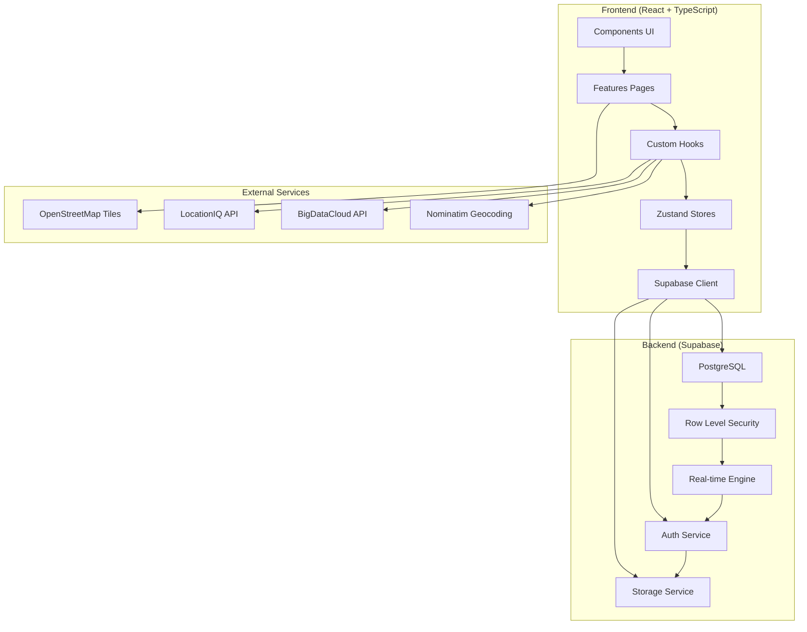

# 🏗️ Architecture Technique - Entraide Universelle

## 🎯 Vue d'Ensemble

Entraide Universelle suit une **architecture moderne frontend-first** avec un backend-as-a-service (Supabase), conçue pour être scalable, maintenable et performante. L'application adopte une approche component-driven avec séparation claire des responsabilités.

## 📐 Principes Architecturaux

### **1. Frontend-First Architecture**
- **React 18** avec concurrent features (Suspense, transitions)
- **TypeScript strict** pour la sécurité de type
- **Composants fonctionnels** avec hooks exclusivement
- **État immutable** avec Zustand

### **2. Feature-Based Organization**
- Modules organisés par fonctionnalité métier
- Composants réutilisables dans `/components`
- Logic business encapsulée dans hooks personnalisés
- Stores séparés par domaine

### **3. Real-Time First**
- Synchronisation temps réel avec Supabase subscriptions
- Optimistic updates pour la réactivité
- Gestion des états de connexion/déconnexion
- Fallbacks gracieux pour mode offline

### **4. Mobile-First Design**
- Interface responsive avec Tailwind CSS
- Navigation mobile native
- Gestures et animations touch-friendly
- Progressive Web App capabilities

## 🏛️ Architecture Globale



## 🗂️ Structure Détaillée

### **Frontend Layer Structure**

```
src/
├── App.tsx                      # Root component avec routing
├── main.tsx                     # Point d'entrée React
├── index.css                    # Styles globaux et Tailwind
│
├── components/                   # Composants UI réutilisables
│   ├── ui/                      # Design system base
│   │   ├── Button.tsx           # Composant bouton avec variants
│   │   ├── Input.tsx            # Input avec validation
│   │   ├── Card.tsx             # Container avec styles
│   │   ├── LocationMap.tsx      # Carte Leaflet intégrée
│   │   └── ...
│   ├── chat/                    # Composants messagerie
│   │   ├── ChatWindow.tsx       # Interface conversation
│   │   └── ConversationList.tsx # Liste conversations
│   ├── layout/                  # Layout et structure
│   │   └── Navigation.tsx       # Navigation desktop
│   └── navigation/              # Navigation mobile
│       └── BottomNavigation.tsx # Barre navigation mobile
│
├── features/                    # Pages par fonctionnalité
│   ├── landing/                 # Page publique
│   │   └── LandingPage.tsx     # Landing pour non-connectés
│   ├── auth/                   # Authentification
│   │   ├── Auth.tsx            # Login/Register forms
│   │   └── Onboarding.tsx      # Guide nouveaux utilisateurs
│   ├── home/                   # Accueil connecté
│   │   └── HomePage.tsx        # Feed tâches et stats
│   ├── map/                    # Carte interactive
│   │   └── MapPage.tsx         # Vue carte avec filtres
│   ├── chat/                   # Messagerie
│   │   └── ChatPage.tsx        # Interface chat complète
│   ├── dashboard/              # Analytics
│   │   └── DashboardPage.tsx   # Métriques et rapports
│   ├── profile/                # Profil utilisateur
│   │   └── ProfilePage.tsx     # Gestion profil/settings
│   ├── wallet/                 # Portefeuille
│   │   └── WalletPage.tsx      # Crédits et transactions
│   ├── add/                    # Création tâches
│   │   └── AddTaskPage.tsx     # Formulaire création
│   ├── edit/                   # Modification tâches
│   │   └── EditTaskPage.tsx    # Formulaire édition
│   └── task-detail/            # Détail tâche
│       └── TaskDetailPage.tsx  # Vue détaillée + actions
│
├── hooks/                      # Logic business réutilisable
│   ├── useAuth.ts             # Gestion authentification
│   ├── useGeolocation.ts      # Géolocalisation multi-tentatives
│   ├── useReverseGeocoding.ts # Géocodage inverse multi-services
│   └── useRealtimeMessages.ts # Messages temps réel
│
├── stores/                     # État global Zustand
│   ├── authStore.ts           # Auth state + actions
│   ├── taskStore.ts           # Tasks state + CRUD + analytics
│   └── messageStore.ts        # Messages state + real-time
│
├── types/                      # Interfaces TypeScript
│   └── index.ts               # Types centralisés (User, Task, Message...)
│
└── lib/                       # Configuration et utilitaires
    ├── supabase.ts           # Client Supabase configuré
    ├── utils.ts              # Fonctions utilitaires
    └── router.ts             # Configuration React Router
```

## 🔧 Architecture des Composants

### **1. Design System (UI Components)**

```typescript
// Exemple: Button.tsx
interface ButtonProps {
  variant: 'primary' | 'secondary' | 'outline' | 'ghost' | 'danger';
  size: 'sm' | 'md' | 'lg';
  loading?: boolean;
  icon?: React.ReactNode;
  children: React.ReactNode;
}

const Button: React.FC<ButtonProps> = ({ 
  variant, size, loading, icon, children, ...props 
}) => {
  // Implementation avec Tailwind + Framer Motion
};
```

**Avantages :**
- Cohérence visuelle garantie
- Props typées strictement
- Variants configurables
- Animations intégrées
- Accessibilité native

### **2. Feature Components (Pages)**

```typescript
// Exemple: HomePage.tsx
const HomePage: React.FC = () => {
  // Custom hooks pour la logique
  const { user, location } = useAuth();
  const { tasks, isLoading, fetchTasks } = useTaskStore();
  const { coordinates, address } = useGeolocation();
  
  // Rendu JSX avec composants UI
  return (
    <div className="page-container">
      <LocationBanner address={address} />
      <TaskFeed tasks={tasks} loading={isLoading} />
      <BottomNavigation />
    </div>
  );
};
```

**Patterns :**
- Hooks pour la logique métier
- Composants UI pour le rendu
- Props drilling évité avec stores
- Loading states explicites

## 🗃️ Architecture des Données

### **1. Zustand Stores Pattern**

```typescript
// Exemple: taskStore.ts
interface TaskStore {
  // État
  tasks: Task[];
  isLoading: boolean;
  error: string | null;
  
  // Actions
  fetchTasks: () => Promise<void>;
  createTask: (task: CreateTaskRequest) => Promise<void>;
  updateTask: (id: number, updates: Partial<Task>) => Promise<void>;
  deleteTask: (id: number) => Promise<void>;
  
  // Computed
  getDashboardData: () => TaskDashboard;
  filterTasks: (filters: TaskFilter) => Task[];
  sortTasks: (tasks: Task[], sort: TaskSort) => Task[];
}

const useTaskStore = create<TaskStore>((set, get) => ({
  // Implementation avec Supabase integration
}));
```

**Avantages :**
- État centralisé par domaine
- Actions typées strictement
- Computed values optimisées
- Integration Supabase transparente

### **2. Supabase Integration Pattern**

```typescript
// Real-time subscriptions dans stores
useEffect(() => {
const subscription = supabase
  .channel('tasks')
  .on('postgres_changes', 
    { event: '*', schema: 'public', table: 'tasks' },
    (payload) => {
        switch (payload.eventType) {
          case 'INSERT':
            set(state => ({ 
              tasks: [...state.tasks, payload.new as Task] 
            }));
            break;
          case 'UPDATE':
            set(state => ({
              tasks: state.tasks.map(task => 
                task.id === payload.new.id 
                  ? { ...task, ...payload.new } 
                  : task
              )
            }));
            break;
          // etc.
        }
    }
  )
  .subscribe();

  return () => subscription.unsubscribe();
}, []);
```

## 🔄 Architecture des Hooks

### **1. Custom Hooks Pattern**

```typescript
// Exemple: useGeolocation.ts
interface GeolocationState {
  coordinates: Coordinates | null;
  accuracy: number | null;
  isLoading: boolean;
  error: string | null;
}

const useGeolocation = (options?: PositionOptions): GeolocationState => {
  const [state, setState] = useState<GeolocationState>({
    coordinates: null,
    accuracy: null,
    isLoading: false,
    error: null
  });

  const tryGeolocation = useCallback(async () => {
    // Logique multi-tentatives avec fallbacks
    // 1. High accuracy (15s timeout)
    // 2. Standard accuracy (10s timeout)  
    // 3. Low accuracy (5s timeout)
  }, []);

  useEffect(() => {
    tryGeolocation();
  }, [tryGeolocation]);

  return state;
};
```

**Patterns :**
- État local pour UI state
- useCallback pour fonctions stables
- useEffect pour side effects
- Error handling intégré
- TypeScript strict

### **2. Integration Hooks**

```typescript
// Exemple: useReverseGeocoding.ts
const useReverseGeocoding = (lat?: number, lng?: number) => {
  // Services multiples avec fallbacks
  const services = [
    { name: 'Nominatim', url: 'https://nominatim.openstreetmap.org' },
    { name: 'BigDataCloud', url: 'https://api.bigdatacloud.net' },
    { name: 'LocationIQ', url: 'https://eu1.locationiq.com' }
  ];

  const tryGeocodingService = async (service, lat, lng) => {
    // Logique avec timeout et retry
  };

  // Essai séquentiel des services
  // Parsing intelligent des réponses
  // Cache des résultats
};
```

## 🎨 Architecture UI/UX

### **1. Tailwind CSS Strategy**

```typescript
// Configuration Tailwind personnalisée
module.exports = {
  content: ['./src/**/*.{js,ts,jsx,tsx}'],
  theme: {
    extend: {
      colors: {
        primary: {
          50: '#eff6ff',
          // ... gamme complète
          900: '#1e3a8a'
        }
      },
      animation: {
        'fade-in': 'fadeIn 0.3s ease-out',
        'slide-up': 'slideUp 0.4s ease-out',
        'pulse-slow': 'pulse 2s ease-in-out infinite'
      }
    }
  },
  plugins: [
    require('@tailwindcss/forms'),
    require('@tailwindcss/typography')
  ]
};
```

**Patterns :**
- Utility-first approach
- Custom design tokens
- Animations CSS intégrées
- Responsive breakpoints
- Dark mode support (planifié)

### **2. Framer Motion Integration**

```typescript
// Animations déclaratives
const PageTransition: React.FC = ({ children }) => (
  <motion.div
    initial={{ opacity: 0, y: 20 }}
    animate={{ opacity: 1, y: 0 }}
    exit={{ opacity: 0, y: -20 }}
    transition={{ duration: 0.3, ease: 'easeOut' }}
  >
    {children}
  </motion.div>
);

// Micro-interactions
const Button = motion.button.attrs({
  whileHover: { scale: 1.02 },
  whileTap: { scale: 0.98 },
  transition: { type: 'spring', stiffness: 400, damping: 17 }
});
```

## 🔐 Architecture Sécurité

### **1. Row Level Security (RLS)**

```sql
-- Politique pour table tasks
CREATE POLICY "Users can view all tasks" ON tasks
  FOR SELECT USING (true);

CREATE POLICY "Users can create own tasks" ON tasks
  FOR INSERT WITH CHECK (auth.uid() = user_id);

CREATE POLICY "Users can update own tasks" ON tasks
  FOR UPDATE USING (auth.uid() = user_id);

CREATE POLICY "Assigned users can update tasks" ON tasks
  FOR UPDATE USING (auth.uid() = assigned_to);
```

**Avantages :**
- Sécurité au niveau base de données
- Pas de logique côté client
- Politiques granulaires
- Audit automatique

### **2. Client-Side Security**

```typescript
// Validation côté client
const validateTaskInput = (task: CreateTaskRequest): ValidationResult => {
  const errors: string[] = [];
  
  if (!task.title?.trim()) errors.push('Titre requis');
  if (!task.description?.trim()) errors.push('Description requise');
  if (task.budget_credits < 0) errors.push('Budget invalide');
  
  return { isValid: errors.length === 0, errors };
};

// Sanitization des inputs
const sanitizeInput = (input: string): string => {
  return input.trim().replace(/<script>/gi, '');
};
```

## 📡 Architecture Real-Time

### **1. Supabase Subscriptions**

```typescript
// Pattern pour subscriptions temps réel
const useRealtimeSubscription = <T>(
  table: string,
  filter?: string,
  callback?: (payload: T) => void
) => {
  useEffect(() => {
    const subscription = supabase
      .channel(`${table}_changes`)
      .on('postgres_changes', 
        { 
          event: '*', 
          schema: 'public', 
          table,
          filter 
        },
        (payload) => {
          callback?.(payload as T);
        }
      )
      .subscribe();

    return () => subscription.unsubscribe();
  }, [table, filter, callback]);
};
```

### **2. Optimistic Updates**

```typescript
// Pattern optimistic pour UX réactive
const createTaskOptimistic = async (taskData: CreateTaskRequest) => {
  // 1. Update optimiste immédiat
  const tempTask: Task = { 
    id: Date.now(), // ID temporaire
    ...taskData, 
    status: 'open',
    created_at: new Date().toISOString()
  };
  
  set(state => ({ 
    tasks: [...state.tasks, tempTask],
    isLoading: false 
  }));

  try {
    // 2. Appel API réel
    const { data, error } = await supabase
      .from('tasks')
      .insert(taskData)
      .select()
      .single();

    if (error) throw error;

    // 3. Remplacer par données réelles
    set(state => ({
      tasks: state.tasks.map(task => 
        task.id === tempTask.id ? data : task
      )
    }));
  } catch (error) {
    // 4. Rollback en cas d'erreur
    set(state => ({
      tasks: state.tasks.filter(task => task.id !== tempTask.id),
      error: error.message
    }));
  }
};
```

## 🚀 Architecture Performance

### **1. Code Splitting**

```typescript
// Lazy loading des pages
const HomePage = lazy(() => import('@/features/home/HomePage'));
const MapPage = lazy(() => import('@/features/map/MapPage'));
const ChatPage = lazy(() => import('@/features/chat/ChatPage'));

// Route-based splitting
const App = () => (
  <Router>
    <Suspense fallback={<LoadingScreen />}>
      <Routes>
        <Route path="/" element={<HomePage />} />
        <Route path="/map" element={<MapPage />} />
        <Route path="/chat" element={<ChatPage />} />
      </Routes>
    </Suspense>
  </Router>
);
```

### **2. Memoization Strategy**

```typescript
// Composants lourds memoizés
const TaskCard = memo(({ task, onEdit, onDelete }) => {
  // Rendu expensive
}, (prevProps, nextProps) => {
  return prevProps.task.id === nextProps.task.id &&
         prevProps.task.updated_at === nextProps.task.updated_at;
});

// Callbacks stables
const handleTaskUpdate = useCallback((taskId: number, updates: Partial<Task>) => {
  updateTask(taskId, updates);
}, [updateTask]);

// Computed values optimisées
const filteredTasks = useMemo(() => {
  return filterTasks(tasks, activeFilters);
}, [tasks, activeFilters]);
```

### **3. Bundle Optimization**

```typescript
// vite.config.ts
export default defineConfig({
  build: {
    rollupOptions: {
      output: {
        manualChunks: {
          vendor: ['react', 'react-dom'],
          supabase: ['@supabase/supabase-js'],
          ui: ['framer-motion', 'lucide-react'],
          maps: ['leaflet', 'react-leaflet']
        }
      }
    }
  }
});
```

## 📱 Architecture Mobile

### **1. Progressive Web App**

```typescript
// Service Worker registration
if ('serviceWorker' in navigator) {
  navigator.serviceWorker.register('/sw.js')
    .then(registration => {
      console.log('SW registered:', registration);
    });
}

// Manifest PWA
{
  "name": "Entraide Universelle",
  "short_name": "Entraide",
  "display": "standalone",
  "orientation": "portrait",
  "theme_color": "#3B82F6",
  "background_color": "#F8FAFC",
  "start_url": "/",
  "icons": [...]
}
```

### **2. Responsive Design**

```css
/* Breakpoints Tailwind personnalisés */
@media (max-width: 640px) {
  /* Mobile styles */
}

@media (min-width: 768px) {
  /* Tablet styles */
}

@media (min-width: 1024px) {
  /* Desktop styles */
}
```

## 🔮 Évolutions Architecturales

### **Version 2.0 - Microservices**
- API Gateway avec rate limiting
- Services spécialisés (notifications, payments)
- Event-driven architecture
- CQRS pattern pour analytics

### **Version 3.0 - AI/ML Integration**
- Recommandation engine
- NLP pour matching intelligent
- Computer vision pour tâches
- Predictive analytics

### **Scalabilité Future**
- CDN pour assets statiques
- Database sharding par région
- Redis pour cache distribué
- Message queues pour async processing

---

**Cette architecture garantit maintenabilité, performance et évolutivité pour supporter la croissance d'Entraide Universelle.**