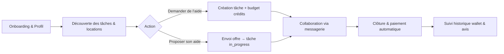

---

title: Analyse de l'application Entraide Universelle
author: Équipe Conseil
date: 2025-09-02
----------------

## Résumé exécutif

Entraide Universelle est une plateforme mobile-first d’entraide géolocalisée, permettant aux particuliers de demander ou proposer de l’aide au sein de leur zone via un système de crédits. La solution combine pertinence locale, expérience utilisateur fluide et paiements sécurisés, tout en offrant un modèle de monétisation multiple (vente de crédits, frais de service, location d’objets).

Les principales priorités pour maximiser l’engagement et la croissance sont : finaliser la messagerie et les notifications avancées, déployer le système de notation/avis, optimiser le funnel de crédits et renforcer la conformité RGPD. La plateforme dispose d’un fort potentiel de rétention et de monétisation durable si ces briques clés sont complétées.

---

## 1) Présentation et fonctionnement de l’application

### 1.1 Vision

Entraide Universelle connecte des particuliers pour solliciter ou proposer de l’aide locale (bricolage, garde, déménagement, etc.) via un système de crédits, en s’appuyant sur une expérience mobile-first et une interface intuitive.

### 1.2 Fonctionnalités principales (MVP + V1)

* **Authentification et profil** : Supabase Auth, géolocalisation, onboarding.
* **Gestion des tâches** : création, statut, catégories, filtrage par distance/budget/catégorie.
* **Système de crédits (wallet)** : portefeuille, achats de crédits, gains pour services rendus, retraits automatiques.
* **Messagerie temps réel** : chat lié aux tâches, historique, notifications.
* **Géolocalisation** : carte Leaflet, recherche par proximité, géocodage, adresses détaillées.
* **Interface responsive** : Tailwind, animations Framer Motion, navigation à onglets.
* **Marketplace de location (beta)** : objets à louer, réservation/paiement.

### 1.3 Parcours utilisateur type

1. Onboarding & localisation : compte, géolocalisation, profil.
2. Découverte : tâches et locations proches avec filtres.
3. Action : demander ou proposer de l’aide.
4. Collaboration : échanges via messagerie et carte.
5. Clôture et paiement automatique.
6. Suivi : historique, gains, notations/avis.

### 1.4 Stack et architecture

* **Frontend** : React 18 + TypeScript, Vite, Tailwind CSS, Framer Motion, React Router, Zustand.
* **Backend & services** : Supabase (PostgreSQL, Auth, RLS, Realtime, Storage), Stripe, Nominatim/BigDataCloud.
* **Qualité** : ESLint, Prettier, Jest, TypeScript strict.

---

## 2) Avantages et points forts

### 2.1 Pour les utilisateurs

* Rapidité et proximité grâce à la géolocalisation.
* Paiements automatiques et traçables.
* UI mobile-first claire et intuitive.
* Motivation via crédits pour fluidifier l’échange.

### 2.2 Pour le business/produit

* Architecture feature-based extensible.
* Différenciation locale et potentiel d’effets de réseau.
* Monétisation multiple : crédits, frais, location, partenariats.
* Données actionnables pour décisions produit et marketing.

---

## 3) Limites et points faibles

| Limite / Risque                   | Impact potentiel           | Mitigation recommandée                     |
| --------------------------------- | -------------------------- | ------------------------------------------ |
| Dépendance BaaS (Supabase/Stripe) | Coût, quotas, verrouillage | Suivi coûts, backups, audit dépendances    |
| Fidélisation & confiance          | Adoption faible            | Système de notation/avis, badges           |
| Notifications & réactivité        | Engagement limité          | Messagerie/notifications V1.5              |
| Légalité & RGPD                   | Amendes, réputation        | Paramètres consentement granulaires, audit |
| Scalabilité temps réel            | Latence, crash             | Monitoring, clustering, tests charge       |
| Monétisation équilibrée           | Adoption freinée           | A/B testing prix, bundles, promotions      |

---

## 4) Business model et monétisation

### 4.1 Revenus directs

* Vente de crédits (Stripe).
* Frais de service sur paiements automatiques.
* Location d’objets : frais de transaction, dépôts/assurances.

### 4.2 Revenus indirects et upsells

* Abonnements premium (boost visibilité, filtres avancés, analytics).
* Parrainage & fidélité : bonus crédits.
* Partenariats locaux : cashback, codes promo, sponsoring.
* API/Intégrations B2B (moyen terme).

### 4.3 Stratégies de croissance

* Go-to-market local : ciblage par ville/quartier, ambassadeurs.
* Effets de réseau : crédits, challenges communautaires.
* SEO et contenu local : landing pages par zone/catégorie.
* Mobile & notifications : PWA/React Native, push ciblées.

---

## 5) Recommandations prioritaires

1. Finaliser messagerie et notifications avancées (V1.5) pour améliorer engagement et rétention.
2. Déployer notation/avis et badges pour renforcer confiance.
3. Optimiser funnel crédits : déficit, bundles, bonus de bienvenue, A/B testing.
4. Renforcer conformité RGPD & privacy : granularité permissions, archivage, minimisation données.
5. Monitoring produit : définir KPIs clés (engagement, temps de réponse, rétention 30j, NPS).

---

## 6) Conclusion

Entraide Universelle combine utilité sociale, pertinence locale et solidité technique. Avec la finalisation des briques d’engagement et de confiance, la plateforme possède un fort potentiel de rétention et de monétisation via un écosystème de crédits, services et partenariats locaux.

---
Annexes: voir `docs/README.md`, `docs/FEATURES_ROADMAP.md`, `docs/SYSTEME_PAIEMENT_AUTOMATIQUE.md`, `docs/GUIDE_IMPLEMENTATION_WALLET.md` pour les détails techniques.

